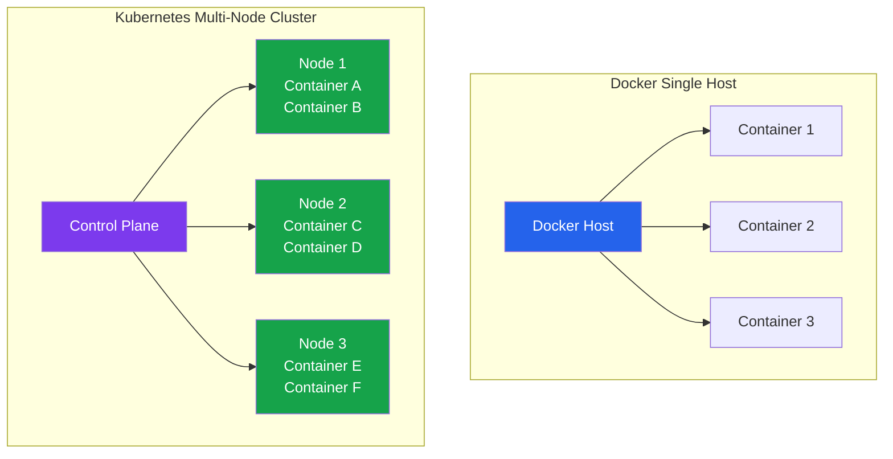

# Module 01 — Docker vs Kubernetes

## One Bus vs. a Bus Fleet

Imagine you're a city transit authority. At first, your city is small — one bus, one driver, one route. If the bus breaks down, you fix it. If rush hour gets busy, the driver works harder. This is Docker: one machine, you're in charge.

Now your city grows. You need fifty buses on twenty routes. You can't manually watch each bus and dispatch drivers — you need a **control system** that tracks the whole fleet, reroutes buses when one breaks down, adds buses during rush hour automatically, and ensures the right buses go to the right routes.

That control system is Kubernetes.

---

## Docker Runs Containers on ONE Machine

Docker is brilliant at what it does. It:
- Packages applications into portable, self-contained images
- Runs containers on a single host
- Manages those containers with a simple API
- Lets you compose multi-container apps with Docker Compose

Docker's limits become apparent when you ask: what happens when the machine goes down? How do you run across 10 machines? How do you auto-scale when traffic spikes at midnight?

Docker alone has no answer to these questions. It wasn't designed for them.

---

## Kubernetes Runs Containers Across MANY Machines

Kubernetes (K8s) is a container orchestration platform. It abstracts multiple machines into a single logical compute surface. You tell Kubernetes "I need 5 replicas of this container" — Kubernetes figures out which of its nodes to run them on, keeps them running, and replaces them if they crash.



---

## What Docker Compose Cannot Do

Docker Compose is excellent for local development and simple multi-container deployments on a single machine. But it has hard limits:

| Capability | Docker Compose | Kubernetes |
|---|---|---|
| Multiple hosts | No — single machine only | Yes — runs across many nodes |
| Self-healing | No — if a container dies, it stays dead unless you use `restart: unless-stopped` | Yes — replaces failed Pods automatically |
| Auto-scaling | No — you change replica count manually | Yes — HPA scales on CPU/memory/custom metrics |
| Load balancing across nodes | No | Yes — built-in service load balancing |
| Rolling updates with zero downtime | Limited | Yes — Deployment rollout strategy |
| Health-based traffic routing | No | Yes — readiness probes gate traffic |
| Multi-tenant isolation | No | Yes — namespaces with RBAC |
| Persistent storage orchestration | Volume mounts only | Yes — PVC/StorageClass dynamic provisioning |
| Node failure recovery | No | Yes — reschedules Pods to healthy nodes |

---

## When Docker Compose Is Enough

Don't add complexity you don't need. Docker Compose is the right tool when:

- You're running on a **single server** and that's fine
- Your app is simple enough that **manual restarts are acceptable**
- Your team is small and the **operational overhead of K8s isn't worth it**
- You're in early stages and **moving fast matters more than resilience**
- Internal tooling or developer environments
- Staging/preview environments for small teams

Many successful production applications run on a single beefy server with Docker Compose and a cron job to restart unhealthy containers. Don't let "you should use Kubernetes" become premature optimization.

---

## When You Need Kubernetes

Kubernetes becomes the right choice when:

- You need to run across **multiple machines** for capacity or availability
- You need **automatic self-healing** — if a Pod dies, it restarts without human intervention
- You need **auto-scaling** — the number of replicas should track traffic automatically
- You have **multiple teams** deploying independently to shared infrastructure
- You need **advanced deployment strategies** — canary releases, blue/green, A/B testing
- You need **complex networking** — Ingress routing, network policies, service mesh
- You're using **cloud-managed services** — EKS, GKE, AKS provide managed control planes

---

## K8s Doesn't Replace Docker

This is a common misconception. Kubernetes doesn't use "Docker" specifically — it uses a container runtime interface (CRI), and the most common runtime is **containerd** (which Docker also uses internally).

The relationship:
- Docker's Dockerfile and image format (OCI spec) are the standard. K8s runs images built with Docker, Buildah, or any OCI-compliant tool.
- Docker Hub, ECR, GHCR — K8s pulls images from these same registries
- You still write Dockerfiles. You still use `docker build`. You still push to a registry.
- Kubernetes then pulls those images and runs them via containerd

The pipeline remains:
```
Write code → docker build → docker push → kubectl apply → K8s runs the container
```

The difference is what runs the container and where — not how the container is built.

---

## The Vocabulary Shift

When moving from Docker to Kubernetes, some concepts have new names:

| Docker Concept | Kubernetes Equivalent |
|---|---|
| `docker run` | Pod (the smallest deployable unit) |
| `docker-compose.yml` | Multiple K8s YAML manifests |
| Service in Compose | Deployment (manages Pod replicas) |
| Container restart policy | Pod restart policy + liveness probes |
| Docker network | K8s Service (for discovery/routing) |
| Docker volume | PersistentVolumeClaim |
| `depends_on` | readinessProbe + init containers |
| `docker service` (Swarm) | Deployment |
| `docker secret` | K8s Secret |
| Environment variables | ConfigMap / Secret |
| Port mapping `-p 80:80` | Service type NodePort/LoadBalancer |
| Health check | livenessProbe + readinessProbe |

---

## 📂 Navigation

| | Link |
|---|---|
| Section Home | [Section 03 — Docker to K8s](../README.md) |
| Comparison Table | [Docker vs K8s Comparison](./Comparison.md) |
| Interview Q&A | [Docker vs K8s Q&A](./Interview_QA.md) |
| Next | [02 · Compose to K8s Migration](../02_Compose_to_K8s_Migration/Theory.md) |
| Back to Docker | [Docker Section](../../01_Docker/15_Best_Practices/Theory.md) |
| Forward to K8s | [What is Kubernetes](../../02_Kubernetes/01_What_is_Kubernetes/Theory.md) |
