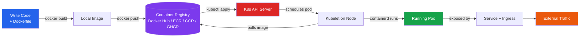
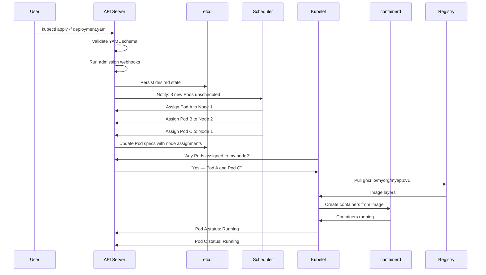

# Module 03 — Image to Deployment Workflow

## From Code to Running Pod

You've written a Python app, created a Dockerfile, built an image, and tested it with `docker run`. Now what? How does that image get into a running Kubernetes pod that auto-scales, self-heals, and serves real traffic?

If you've only used Docker locally, the jump to Kubernetes can feel like there's a missing chapter. You run `docker build` and you have an image. But then there's this gap — registries, YAML manifests, API servers, schedulers — and somehow at the end of all that, your container is running in a cluster. What happened in the middle?

The journey from `docker build` to `kubectl get pods` involves 5 concrete steps — and understanding each one removes all the mystery from Kubernetes deployments. This module walks through every step in sequence, explaining what happens at each stage and why.

---

## 📌 Learning Priority

**Must Learn** — core concepts, needed to understand the rest of this file:
[Complete Pipeline](#the-complete-pipeline) · [Write Deployment YAML](#step-3-write-the-deployment-yaml) · [Apply to Cluster](#step-4-apply-to-the-cluster----what-happens-under-the-hood)

**Should Learn** — important for real projects and interviews:
[Push to Registry](#step-2-push-to-a-registry) · [Expose with Service and Ingress](#step-5-expose-with-service-and-ingress) · [Rolling Updates](#updates-change-image-tag--rolling-update)

**Good to Know** — useful in specific situations, not needed daily:
[Rollbacks](#rollbacks) · [imagePullPolicy Options](#step-3-write-the-deployment-yaml)

**Reference** — skim once, look up when needed:
[Build the Image](#step-1-build-the-image)

---

## The Complete Pipeline



---

## Step 1: Build the Image

A Dockerfile describes how to build your application image. Kubernetes doesn't build images — you build them yourself and push to a registry. The `docker build` step is exactly what you already know.

```dockerfile
# Production-ready Dockerfile (Python example)
FROM python:3.12-slim AS base
WORKDIR /app

FROM base AS deps
COPY requirements.txt .
RUN pip install --no-cache-dir -r requirements.txt

FROM deps AS final
COPY . .
RUN addgroup --system app && adduser --system --group app
USER app
HEALTHCHECK --interval=30s --timeout=5s CMD python -c "import urllib.request; urllib.request.urlopen('http://localhost:8080/health')"
EXPOSE 8080
CMD ["python", "app.py"]
```

```bash
# Build the image
docker build -t myapp:v1 .

# Multi-platform build (K8s nodes may run on ARM, especially on AWS Graviton)
docker buildx build --platform linux/amd64,linux/arm64 -t myapp:v1 .

# With build args (version info baked into the binary)
docker build \
  --build-arg VERSION=1.0.0 \
  --build-arg GIT_SHA=$(git rev-parse --short HEAD) \
  -t myapp:v1 .
```

**Critical: Never use `latest` as a Kubernetes tag.** Kubernetes caches images on nodes. If you push a new image with the same `latest` tag, nodes with `imagePullPolicy: IfNotPresent` won't pull the update — they'll keep using the old cached image. Use versioned tags:
- Semantic version: `v1.2.3`
- Git commit SHA: `abc1234`
- Build timestamp: `20240315-142500`

---

## Step 2: Push to a Registry

Kubernetes nodes pull images from a container registry — they cannot access your local Docker daemon. Before deploying to Kubernetes, the image must be in a registry the cluster can reach.

**Image naming convention:**
```
<registry>/<namespace>/<image-name>:<tag>

docker.io/myusername/myapp:v1                                    # Docker Hub
123456789.dkr.ecr.us-east-1.amazonaws.com/myapp:v1              # AWS ECR
gcr.io/my-gcp-project/myapp:v1                                   # Google Container Registry
ghcr.io/myorg/myapp:v1                                           # GitHub Container Registry
myregistry.azurecr.io/myapp:v1                                   # Azure Container Registry
```

```bash
# Docker Hub (public or private)
docker login
docker tag myapp:v1 myusername/myapp:v1
docker push myusername/myapp:v1

# AWS ECR (authenticate first, then push)
aws ecr get-login-password --region us-east-1 | \
  docker login --username AWS --password-stdin \
  123456789.dkr.ecr.us-east-1.amazonaws.com
docker tag myapp:v1 123456789.dkr.ecr.us-east-1.amazonaws.com/myapp:v1
docker push 123456789.dkr.ecr.us-east-1.amazonaws.com/myapp:v1

# GitHub Container Registry
echo $GITHUB_TOKEN | docker login ghcr.io -u myusername --password-stdin
docker tag myapp:v1 ghcr.io/myorg/myapp:v1
docker push ghcr.io/myorg/myapp:v1
```

**For private registries**, Kubernetes needs credentials to pull. Create an `imagePullSecret`:

```bash
kubectl create secret docker-registry regcred \
  --docker-server=ghcr.io \
  --docker-username=myusername \
  --docker-password=$GITHUB_TOKEN \
  --namespace=production
```

---

## Step 3: Write the Deployment YAML

A Deployment is the standard Kubernetes resource for running a long-running application. It manages a ReplicaSet (which manages Pods), handles rolling updates, and enables rollbacks.

```yaml
apiVersion: apps/v1
kind: Deployment
metadata:
  name: myapp
  namespace: production
  labels:
    app: myapp
    version: v1
spec:
  replicas: 3
  selector:
    matchLabels:
      app: myapp
  strategy:
    type: RollingUpdate
    rollingUpdate:
      maxSurge: 1        # Allow 1 extra Pod during update
      maxUnavailable: 0  # Never drop below 3 running Pods
  template:
    metadata:
      labels:
        app: myapp
        version: v1
    spec:
      containers:
        - name: myapp
          image: ghcr.io/myorg/myapp:v1   # Never use :latest
          imagePullPolicy: IfNotPresent    # Cache versioned tags on nodes
          ports:
            - containerPort: 8080
          resources:
            requests:
              cpu: "100m"       # Minimum 0.1 CPU cores guaranteed
              memory: "128Mi"   # Minimum 128MB RAM guaranteed
            limits:
              cpu: "500m"       # Maximum 0.5 CPU cores
              memory: "512Mi"   # Maximum 512MB RAM
          readinessProbe:       # Traffic withheld until this passes
            httpGet:
              path: /health
              port: 8080
            initialDelaySeconds: 5
            periodSeconds: 10
          livenessProbe:        # Container restarted if this fails
            httpGet:
              path: /health
              port: 8080
            initialDelaySeconds: 15
            periodSeconds: 20
      imagePullSecrets:
        - name: regcred         # Only needed for private registries
```

**imagePullPolicy options:**

| Value | Behavior | When to Use |
|---|---|---|
| `Always` | Always pull from registry on every Pod start | Mutable tags like `latest` (not recommended for prod) |
| `IfNotPresent` | Pull only if not cached on the node | Best for versioned tags (default behavior for non-latest tags) |
| `Never` | Never pull — fail if not pre-loaded | Air-gapped or pre-loaded node environments |

---

## Step 4: Apply to the Cluster — What Happens Under the Hood

When you run `kubectl apply -f deployment.yaml`, a multi-component chain fires:



**What each component does:**
- **API Server**: The front door to Kubernetes. Validates every request and stores state.
- **etcd**: Kubernetes's database. Stores all desired state — nothing is lost if a node goes down.
- **Scheduler**: Picks which node runs each Pod based on resource availability, affinity rules, and taints.
- **Kubelet**: The agent on every node. Watches for Pods assigned to it and tells containerd to run them.
- **containerd**: The container runtime. Pulls the image from the registry and starts the container process.

---

## Step 5: Expose with Service and Ingress

A running Pod has a cluster-internal IP that changes every time the Pod is replaced. A **Service** provides a stable endpoint:

```yaml
apiVersion: v1
kind: Service
metadata:
  name: myapp
  namespace: production
spec:
  selector:
    app: myapp         # Routes traffic to all Pods with this label
  ports:
    - port: 80
      targetPort: 8080
  type: ClusterIP      # Internal only — use for service-to-service traffic
```

An **Ingress** routes external HTTP/HTTPS traffic to Services:

```yaml
apiVersion: networking.k8s.io/v1
kind: Ingress
metadata:
  name: myapp-ingress
  namespace: production
spec:
  rules:
    - host: myapp.example.com
      http:
        paths:
          - path: /
            pathType: Prefix
            backend:
              service:
                name: myapp
                port:
                  number: 80
  tls:
    - hosts:
        - myapp.example.com
      secretName: myapp-tls
```

---

## Updates: Change Image Tag → Rolling Update

```bash
# Option 1: Update the YAML (preferred — tracked in git)
# Edit deployment.yaml: image: ghcr.io/myorg/myapp:v2
kubectl apply -f deployment.yaml

# Option 2: Imperative update
kubectl set image deployment/myapp myapp=ghcr.io/myorg/myapp:v2 -n production

# Monitor the rollout
kubectl rollout status deployment/myapp -n production

# View rollout history
kubectl rollout history deployment/myapp -n production
```

**What happens during a rolling update:**
1. Kubernetes starts a new Pod with the new image
2. Waits for the readiness probe to pass
3. Only then routes traffic to the new Pod
4. Terminates one old Pod
5. Repeats until all Pods run the new version

With `maxUnavailable: 0` and `maxSurge: 1`, you never have less than your target replica count serving traffic.

---

## Rollbacks

```bash
# Rollback to the previous version immediately
kubectl rollout undo deployment/myapp -n production

# Rollback to a specific historical revision
kubectl rollout history deployment/myapp -n production
kubectl rollout undo deployment/myapp --to-revision=3 -n production

# Verify the rollback
kubectl rollout status deployment/myapp -n production
kubectl get pods -n production
kubectl describe deployment myapp -n production | grep Image
```

Kubernetes keeps the previous ReplicaSets around (up to `revisionHistoryLimit`, default 10) specifically to enable fast rollbacks.

---

## 📂 Navigation

⬅️ **Prev:** [Compose to K8s Migration](../02_Compose_to_K8s_Migration/Interview_QA.md) &nbsp;&nbsp;&nbsp; ➡️ **Next:** [Projects](../../05_Capstone_Projects/01_Dockerize_a_Python_App/01_MISSION.md)

| File | Description |
|---|---|
| [Theory.md](./Theory.md) | You are here — Image to Deployment full explanation |
| [Cheatsheet.md](./Cheatsheet.md) | Quick reference commands |
| [Interview_QA.md](./Interview_QA.md) | Interview questions and answers |
