**Zero to Production · Docker + Kubernetes · Story-Based · Beginner Friendly**

### 🐳 What Is This Repo?

A complete, structured learning guide for **Docker and Kubernetes** — from your first container all the way to production-grade cluster management, GitOps, service meshes, and multi-cloud deployments.

Every topic follows the same format:
- 📖 **Theory.md** — Story-first explanation with real analogies, then technical deep dive + Mermaid diagrams
- ⚡ **Cheatsheet.md** — Quick-reference card with commands, flags, and patterns
- 🎯 **Interview_QA.md** — Beginner → Advanced Q&A to test yourself
- 💻 **Code_Example.md** — Working YAML/Dockerfiles/scripts with inline comments

> Docker and Kubernetes are taught together as one continuous journey — build an image, push it, deploy it, manage it at scale.

### 🗺️ Section Overview

| # | Section | Topics | Level | Time |
|---|---------|--------|-------|------|
| 🐳 **01** | [Docker](./01_Docker/) | Containers, Images, Dockerfile, Volumes, Networking, Compose, Registry, Security | Beginner–Intermediate | 15–18 hrs |
| ⎈ **02** | [Kubernetes](./02_Kubernetes/) | Pods → Deployments → Services → RBAC → Autoscaling → Mesh | Intermediate–Expert | 35–40 hrs |
| 🔗 **03** | [Docker → K8s](./03_Docker_to_K8s/) | Bridge: how Docker maps to K8s, Compose migration, image-to-deployment | Bridge | 4–5 hrs |
| 🏗️ **05** | [Capstone Projects](./05_Capstone_Projects/) | 10 end-to-end projects from single container to production AI microservice | All levels | 30+ hrs |

**Total: ~85–100 hours of structured learning**

### 🛤️ Choose Your Path

<strong>🐳 Docker Path — I'm new to containers (Start here!)</strong>

> Goal: Understand containers, build images, run apps with Docker and Compose.

| Step | Module | What You'll Learn |
|------|--------|-------------------|
| 1 | [Virtualization & Containers](./01_Docker/01_Virtualization_and_Containers/Theory.md) | VMs vs containers, why Docker exists |
| 2 | [Docker Architecture](./01_Docker/02_Docker_Architecture/Theory.md) | Daemon, client, registry, image layers |
| 3 | [Installation & Setup](./01_Docker/03_Installation_and_Setup/Theory.md) | Install Docker, first `docker run` |
| 4 | [Images & Layers](./01_Docker/04_Images_and_Layers/Theory.md) | Pull, inspect, layer caching |
| 5 | [Dockerfile](./01_Docker/05_Dockerfile/Theory.md) | FROM, RUN, COPY, CMD, ENTRYPOINT |
| 6 | [Container Lifecycle](./01_Docker/06_Containers_Lifecycle/Theory.md) | run, exec, logs, stop, rm, inspect |
| 7 | [Volumes & Bind Mounts](./01_Docker/07_Volumes_and_Bind_Mounts/Theory.md) | Persistent data, bind mounts, tmpfs |
| 8 | [Networking](./01_Docker/08_Networking/Theory.md) | Bridge, host, overlay networks, DNS |
| 9 | [Docker Compose](./01_Docker/09_Docker_Compose/Theory.md) | Multi-container apps, services, depends_on |

**Prerequisite:** Basic command line. No container experience needed.

<strong>🔵 Docker Advanced Path — I know basics, want production skills</strong>

> Goal: Build production-ready images, secure them, push to registries, use in CI/CD.

| Step | Module | What You'll Learn |
|------|--------|-------------------|
| 10 | [Docker Registry](./01_Docker/10_Docker_Registry/Theory.md) | Docker Hub, ECR, GCR, private registries |
| 11 | [Multi-Stage Builds](./01_Docker/11_Multi_Stage_Builds/Theory.md) | Slim images, build-time vs runtime deps |
| 12 | [Docker Security](./01_Docker/12_Docker_Security/Theory.md) | Non-root users, secrets, image scanning |
| 13 | [Docker Swarm](./01_Docker/13_Docker_Swarm/Theory.md) | Basic orchestration, services, stacks |
| 14 | [Docker in CI/CD](./01_Docker/14_Docker_in_CICD/Theory.md) | GitHub Actions, build → push → deploy |
| 15 | [Best Practices](./01_Docker/15_Best_Practices/Theory.md) | Layer optimization, .dockerignore, tagging |
| 16 | [BuildKit & Docker Scout](./01_Docker/16_BuildKit_and_Docker_Scout/Theory.md) | Parallel builds, cache mounts, CVE scanning |
| 17 | [Docker Init & Debug](./01_Docker/17_Docker_Init_and_Debug/Theory.md) | Scaffold projects, debug distroless containers |

**Prerequisite:** Docker beginner path complete.

<strong>⎈ Kubernetes Beginner Path — I know Docker, starting K8s</strong>

> Goal: Understand K8s architecture and deploy apps to a cluster.

| Step | Module | What You'll Learn |
|------|--------|-------------------|
| 1 | [What is Kubernetes](./02_Kubernetes/01_What_is_Kubernetes/Theory.md) | Why K8s, what problems it solves |
| 2 | [K8s Architecture](./02_Kubernetes/02_K8s_Architecture/Theory.md) | Control plane, worker nodes, etcd, kubelet |
| 3 | [Installation & Setup](./02_Kubernetes/03_Installation_and_Setup/Theory.md) | kubectl, minikube, kind, kubeconfig |
| 4 | [Pods](./02_Kubernetes/04_Pods/Theory.md) | Pod spec, lifecycle, multi-container pods |
| 5 | [Deployments & ReplicaSets](./02_Kubernetes/05_Deployments_and_ReplicaSets/Theory.md) | Rolling updates, rollbacks, scaling |
| 6 | [Services](./02_Kubernetes/06_Services/Theory.md) | ClusterIP, NodePort, LoadBalancer |
| 7 | [ConfigMaps & Secrets](./02_Kubernetes/07_ConfigMaps_and_Secrets/Theory.md) | App config, secret injection |
| 8 | [Namespaces](./02_Kubernetes/08_Namespaces/Theory.md) | Isolation, resource scoping |

**Prerequisite:** Docker path complete.

<strong>🔴 Kubernetes Intermediate Path — Running real workloads</strong>

> Goal: Handle networking, storage, access control, and health management.

| Step | Module | What You'll Learn |
|------|--------|-------------------|
| 9 | [Ingress](./02_Kubernetes/09_Ingress/Theory.md) | HTTP routing, TLS, ingress controllers |
| 10 | [Persistent Volumes](./02_Kubernetes/10_Persistent_Volumes/Theory.md) | PV, PVC, StorageClass, dynamic provisioning |
| 11 | [RBAC](./02_Kubernetes/11_RBAC/Theory.md) | Roles, ClusterRoles, ServiceAccounts |
| 12 | [Custom Resources](./02_Kubernetes/12_Custom_Resources/Theory.md) | CRDs, Operators, controller pattern |
| 13 | [DaemonSets & StatefulSets](./02_Kubernetes/13_DaemonSets_and_StatefulSets/Theory.md) | Node agents, ordered stateful workloads |
| 14 | [Health Probes](./02_Kubernetes/14_Health_Probes/Theory.md) | Liveness, readiness, startup probes |
| 15 | [Deployment Strategies](./02_Kubernetes/15_Deployment_Strategies/Theory.md) | Blue/green, canary, rolling, recreate |
| 16 | [Jobs & CronJobs](./02_Kubernetes/17_Jobs_and_CronJobs/Theory.md) | Batch workloads, scheduled tasks |

<strong>🟣 Kubernetes Expert Path — Production, scaling, and security</strong>

> Goal: Operate K8s at scale — autoscaling, security, mesh, GitOps, cost.

| Step | Module | What You'll Learn |
|------|--------|-------------------|
| 17 | [HPA / VPA / Autoscaling](./02_Kubernetes/18_HPA_VPA_Autoscaling/Theory.md) | Horizontal + vertical + cluster autoscaler |
| 18 | [Resource Quotas & Limits](./02_Kubernetes/19_Resource_Quotas_and_Limits/Theory.md) | LimitRange, ResourceQuota, QoS classes |
| 19 | [Network Policies](./02_Kubernetes/20_Network_Policies/Theory.md) | Pod isolation, ingress/egress rules |
| 20 | [Security](./02_Kubernetes/23_Security/Theory.md) | Pod security, admission controllers, OPA |
| 21 | [Service Mesh](./02_Kubernetes/24_Service_Mesh/Theory.md) | Istio/Linkerd, mTLS, traffic management |
| 22 | [GitOps & CI/CD](./02_Kubernetes/25_GitOps_and_CICD/Theory.md) | ArgoCD, Flux, GitOps workflows |
| 23 | [Helm Charts](./02_Kubernetes/26_Helm_Charts/Theory.md) | Packaging apps, values, hooks |
| 24 | [Monitoring & Logging](./02_Kubernetes/22_Monitoring_and_Logging/Theory.md) | Prometheus, Grafana, Loki, EFK |
| 25 | [Advanced Scheduling](./02_Kubernetes/27_Advanced_Scheduling/Theory.md) | Taints, tolerations, affinity, priority |

### 📚 Full Curriculum

<strong>🐳 Section 01 — Docker (17 modules)</strong>

| Module | Theory | Cheatsheet | Interview Q&A | Code |
|--------|--------|------------|---------------|------|
| 01 · Virtualization & Containers | [📖](./01_Docker/01_Virtualization_and_Containers/Theory.md) | [⚡](./01_Docker/01_Virtualization_and_Containers/Cheatsheet.md) | [🎯](./01_Docker/01_Virtualization_and_Containers/Interview_QA.md) | [💻](./01_Docker/01_Virtualization_and_Containers/Code_Example.md) |
| 02 · Docker Architecture | [📖](./01_Docker/02_Docker_Architecture/Theory.md) | [⚡](./01_Docker/02_Docker_Architecture/Cheatsheet.md) | [🎯](./01_Docker/02_Docker_Architecture/Interview_QA.md) | [💻](./01_Docker/02_Docker_Architecture/Code_Example.md) |
| 03 · Installation & Setup | [📖](./01_Docker/03_Installation_and_Setup/Theory.md) | [⚡](./01_Docker/03_Installation_and_Setup/Cheatsheet.md) | [🎯](./01_Docker/03_Installation_and_Setup/Interview_QA.md) | [💻](./01_Docker/03_Installation_and_Setup/Code_Example.md) |
| 04 · Images & Layers | [📖](./01_Docker/04_Images_and_Layers/Theory.md) | [⚡](./01_Docker/04_Images_and_Layers/Cheatsheet.md) | [🎯](./01_Docker/04_Images_and_Layers/Interview_QA.md) | [💻](./01_Docker/04_Images_and_Layers/Code_Example.md) |
| 05 · Dockerfile | [📖](./01_Docker/05_Dockerfile/Theory.md) | [⚡](./01_Docker/05_Dockerfile/Cheatsheet.md) | [🎯](./01_Docker/05_Dockerfile/Interview_QA.md) | [💻](./01_Docker/05_Dockerfile/Code_Example.md) |
| 06 · Container Lifecycle | [📖](./01_Docker/06_Containers_Lifecycle/Theory.md) | [⚡](./01_Docker/06_Containers_Lifecycle/Cheatsheet.md) | [🎯](./01_Docker/06_Containers_Lifecycle/Interview_QA.md) | [💻](./01_Docker/06_Containers_Lifecycle/Code_Example.md) |
| 07 · Volumes & Bind Mounts | [📖](./01_Docker/07_Volumes_and_Bind_Mounts/Theory.md) | [⚡](./01_Docker/07_Volumes_and_Bind_Mounts/Cheatsheet.md) | [🎯](./01_Docker/07_Volumes_and_Bind_Mounts/Interview_QA.md) | [💻](./01_Docker/07_Volumes_and_Bind_Mounts/Code_Example.md) |
| 08 · Networking | [📖](./01_Docker/08_Networking/Theory.md) | [⚡](./01_Docker/08_Networking/Cheatsheet.md) | [🎯](./01_Docker/08_Networking/Interview_QA.md) | [💻](./01_Docker/08_Networking/Code_Example.md) |
| 09 · Docker Compose | [📖](./01_Docker/09_Docker_Compose/Theory.md) | [⚡](./01_Docker/09_Docker_Compose/Cheatsheet.md) | [🎯](./01_Docker/09_Docker_Compose/Interview_QA.md) | [💻](./01_Docker/09_Docker_Compose/Code_Example.md) |
| 10 · Docker Registry | [📖](./01_Docker/10_Docker_Registry/Theory.md) | [⚡](./01_Docker/10_Docker_Registry/Cheatsheet.md) | [🎯](./01_Docker/10_Docker_Registry/Interview_QA.md) | [💻](./01_Docker/10_Docker_Registry/Code_Example.md) |
| 11 · Multi-Stage Builds | [📖](./01_Docker/11_Multi_Stage_Builds/Theory.md) | [⚡](./01_Docker/11_Multi_Stage_Builds/Cheatsheet.md) | [🎯](./01_Docker/11_Multi_Stage_Builds/Interview_QA.md) | [💻](./01_Docker/11_Multi_Stage_Builds/Code_Example.md) |
| 12 · Docker Security | [📖](./01_Docker/12_Docker_Security/Theory.md) | [⚡](./01_Docker/12_Docker_Security/Cheatsheet.md) | [🎯](./01_Docker/12_Docker_Security/Interview_QA.md) | [💻](./01_Docker/12_Docker_Security/Code_Example.md) |
| 13 · Docker Swarm | [📖](./01_Docker/13_Docker_Swarm/Theory.md) | [⚡](./01_Docker/13_Docker_Swarm/Cheatsheet.md) | [🎯](./01_Docker/13_Docker_Swarm/Interview_QA.md) | [💻](./01_Docker/13_Docker_Swarm/Code_Example.md) |
| 14 · Docker in CI/CD | [📖](./01_Docker/14_Docker_in_CICD/Theory.md) | [⚡](./01_Docker/14_Docker_in_CICD/Cheatsheet.md) | [🎯](./01_Docker/14_Docker_in_CICD/Interview_QA.md) | [💻](./01_Docker/14_Docker_in_CICD/Code_Example.md) |
| 15 · Best Practices | [📖](./01_Docker/15_Best_Practices/Theory.md) | [⚡](./01_Docker/15_Best_Practices/Cheatsheet.md) | [🎯](./01_Docker/15_Best_Practices/Interview_QA.md) | [💻](./01_Docker/15_Best_Practices/Code_Example.md) |
| 16 · BuildKit & Docker Scout | [📖](./01_Docker/16_BuildKit_and_Docker_Scout/Theory.md) | [⚡](./01_Docker/16_BuildKit_and_Docker_Scout/Cheatsheet.md) | [🎯](./01_Docker/16_BuildKit_and_Docker_Scout/Interview_QA.md) | [💻](./01_Docker/16_BuildKit_and_Docker_Scout/Code_Example.md) |
| 17 · Docker Init & Debug | [📖](./01_Docker/17_Docker_Init_and_Debug/Theory.md) | [⚡](./01_Docker/17_Docker_Init_and_Debug/Cheatsheet.md) | [🎯](./01_Docker/17_Docker_Init_and_Debug/Interview_QA.md) | [💻](./01_Docker/17_Docker_Init_and_Debug/Code_Example.md) |

<strong>⎈ Section 02 — Kubernetes (37 modules)</strong>

| Module | Theory | Cheatsheet | Interview Q&A | Extra |
|--------|--------|------------|---------------|-------|
| 01 · What is Kubernetes | [📖](./02_Kubernetes/01_What_is_Kubernetes/Theory.md) | [⚡](./02_Kubernetes/01_What_is_Kubernetes/Cheatsheet.md) | [🎯](./02_Kubernetes/01_What_is_Kubernetes/Interview_QA.md) | [💻](./02_Kubernetes/01_What_is_Kubernetes/Code_Example.md) |
| 02 · K8s Architecture | [📖](./02_Kubernetes/02_K8s_Architecture/Theory.md) | [⚡](./02_Kubernetes/02_K8s_Architecture/Cheatsheet.md) | [🎯](./02_Kubernetes/02_K8s_Architecture/Interview_QA.md) | [Deep Dive](./02_Kubernetes/02_K8s_Architecture/Architecture_Deep_Dive.md) · [💻](./02_Kubernetes/02_K8s_Architecture/Code_Example.md) |
| 03 · Installation & Setup | [📖](./02_Kubernetes/03_Installation_and_Setup/Theory.md) | [⚡](./02_Kubernetes/03_Installation_and_Setup/Cheatsheet.md) | [🎯](./02_Kubernetes/03_Installation_and_Setup/Interview_QA.md) | [💻](./02_Kubernetes/03_Installation_and_Setup/Code_Example.md) |
| 04 · Pods | [📖](./02_Kubernetes/04_Pods/Theory.md) | [⚡](./02_Kubernetes/04_Pods/Cheatsheet.md) | [🎯](./02_Kubernetes/04_Pods/Interview_QA.md) | [💻](./02_Kubernetes/04_Pods/Code_Example.md) |
| 05 · Deployments & ReplicaSets | [📖](./02_Kubernetes/05_Deployments_and_ReplicaSets/Theory.md) | [⚡](./02_Kubernetes/05_Deployments_and_ReplicaSets/Cheatsheet.md) | [🎯](./02_Kubernetes/05_Deployments_and_ReplicaSets/Interview_QA.md) | [💻](./02_Kubernetes/05_Deployments_and_ReplicaSets/Code_Example.md) |
| 06 · Services | [📖](./02_Kubernetes/06_Services/Theory.md) | [⚡](./02_Kubernetes/06_Services/Cheatsheet.md) | [🎯](./02_Kubernetes/06_Services/Interview_QA.md) | [💻](./02_Kubernetes/06_Services/Code_Example.md) |
| 07 · ConfigMaps & Secrets | [📖](./02_Kubernetes/07_ConfigMaps_and_Secrets/Theory.md) | [⚡](./02_Kubernetes/07_ConfigMaps_and_Secrets/Cheatsheet.md) | [🎯](./02_Kubernetes/07_ConfigMaps_and_Secrets/Interview_QA.md) | [💻](./02_Kubernetes/07_ConfigMaps_and_Secrets/Code_Example.md) |
| 08 · Namespaces | [📖](./02_Kubernetes/08_Namespaces/Theory.md) | [⚡](./02_Kubernetes/08_Namespaces/Cheatsheet.md) | [🎯](./02_Kubernetes/08_Namespaces/Interview_QA.md) | [💻](./02_Kubernetes/08_Namespaces/Code_Example.md) |
| 09 · Ingress | [📖](./02_Kubernetes/09_Ingress/Theory.md) | [⚡](./02_Kubernetes/09_Ingress/Cheatsheet.md) | [🎯](./02_Kubernetes/09_Ingress/Interview_QA.md) | [💻](./02_Kubernetes/09_Ingress/Code_Example.md) |
| 10 · Persistent Volumes | [📖](./02_Kubernetes/10_Persistent_Volumes/Theory.md) | [⚡](./02_Kubernetes/10_Persistent_Volumes/Cheatsheet.md) | [🎯](./02_Kubernetes/10_Persistent_Volumes/Interview_QA.md) | [💻](./02_Kubernetes/10_Persistent_Volumes/Code_Example.md) |
| 11 · RBAC | [📖](./02_Kubernetes/11_RBAC/Theory.md) | [⚡](./02_Kubernetes/11_RBAC/Cheatsheet.md) | [🎯](./02_Kubernetes/11_RBAC/Interview_QA.md) | [💻](./02_Kubernetes/11_RBAC/Code_Example.md) |
| 12 · Custom Resources | [📖](./02_Kubernetes/12_Custom_Resources/Theory.md) | [⚡](./02_Kubernetes/12_Custom_Resources/Cheatsheet.md) | [🎯](./02_Kubernetes/12_Custom_Resources/Interview_QA.md) | [💻](./02_Kubernetes/12_Custom_Resources/Code_Example.md) |
| 13 · DaemonSets & StatefulSets | [📖](./02_Kubernetes/13_DaemonSets_and_StatefulSets/Theory.md) | [⚡](./02_Kubernetes/13_DaemonSets_and_StatefulSets/Cheatsheet.md) | [🎯](./02_Kubernetes/13_DaemonSets_and_StatefulSets/Interview_QA.md) | [💻](./02_Kubernetes/13_DaemonSets_and_StatefulSets/Code_Example.md) |
| 14 · Health Probes | [📖](./02_Kubernetes/14_Health_Probes/Theory.md) | [⚡](./02_Kubernetes/14_Health_Probes/Cheatsheet.md) | [🎯](./02_Kubernetes/14_Health_Probes/Interview_QA.md) | [💻](./02_Kubernetes/14_Health_Probes/Code_Example.md) |
| 15 · Deployment Strategies | [📖](./02_Kubernetes/15_Deployment_Strategies/Theory.md) | [⚡](./02_Kubernetes/15_Deployment_Strategies/Cheatsheet.md) | [🎯](./02_Kubernetes/15_Deployment_Strategies/Interview_QA.md) | [💻](./02_Kubernetes/15_Deployment_Strategies/Code_Example.md) |
| 16 · Sidecar Containers | [📖](./02_Kubernetes/16_Sidecar_Containers/Theory.md) | [⚡](./02_Kubernetes/16_Sidecar_Containers/Cheatsheet.md) | [🎯](./02_Kubernetes/16_Sidecar_Containers/Interview_QA.md) | [💻](./02_Kubernetes/16_Sidecar_Containers/Code_Example.md) |
| 17 · Jobs & CronJobs | [📖](./02_Kubernetes/17_Jobs_and_CronJobs/Theory.md) | [⚡](./02_Kubernetes/17_Jobs_and_CronJobs/Cheatsheet.md) | [🎯](./02_Kubernetes/17_Jobs_and_CronJobs/Interview_QA.md) | [💻](./02_Kubernetes/17_Jobs_and_CronJobs/Code_Example.md) |
| 18 · HPA / VPA / Autoscaling | [📖](./02_Kubernetes/18_HPA_VPA_Autoscaling/Theory.md) | [⚡](./02_Kubernetes/18_HPA_VPA_Autoscaling/Cheatsheet.md) | [🎯](./02_Kubernetes/18_HPA_VPA_Autoscaling/Interview_QA.md) | [💻](./02_Kubernetes/18_HPA_VPA_Autoscaling/Code_Example.md) |
| 19 · Resource Quotas & Limits | [📖](./02_Kubernetes/19_Resource_Quotas_and_Limits/Theory.md) | [⚡](./02_Kubernetes/19_Resource_Quotas_and_Limits/Cheatsheet.md) | [🎯](./02_Kubernetes/19_Resource_Quotas_and_Limits/Interview_QA.md) | [💻](./02_Kubernetes/19_Resource_Quotas_and_Limits/Code_Example.md) |
| 20 · Network Policies | [📖](./02_Kubernetes/20_Network_Policies/Theory.md) | [⚡](./02_Kubernetes/20_Network_Policies/Cheatsheet.md) | [🎯](./02_Kubernetes/20_Network_Policies/Interview_QA.md) | [💻](./02_Kubernetes/20_Network_Policies/Code_Example.md) |
| 21 · Service Accounts | [📖](./02_Kubernetes/21_Service_Accounts/Theory.md) | [⚡](./02_Kubernetes/21_Service_Accounts/Cheatsheet.md) | [🎯](./02_Kubernetes/21_Service_Accounts/Interview_QA.md) | [💻](./02_Kubernetes/21_Service_Accounts/Code_Example.md) |
| 22 · Monitoring & Logging | [📖](./02_Kubernetes/22_Monitoring_and_Logging/Theory.md) | [⚡](./02_Kubernetes/22_Monitoring_and_Logging/Cheatsheet.md) | [🎯](./02_Kubernetes/22_Monitoring_and_Logging/Interview_QA.md) | [💻](./02_Kubernetes/22_Monitoring_and_Logging/Code_Example.md) |
| 23 · Security | [📖](./02_Kubernetes/23_Security/Theory.md) | [⚡](./02_Kubernetes/23_Security/Cheatsheet.md) | [🎯](./02_Kubernetes/23_Security/Interview_QA.md) | [💻](./02_Kubernetes/23_Security/Code_Example.md) |
| 24 · Service Mesh | [📖](./02_Kubernetes/24_Service_Mesh/Theory.md) | [⚡](./02_Kubernetes/24_Service_Mesh/Cheatsheet.md) | [🎯](./02_Kubernetes/24_Service_Mesh/Interview_QA.md) | [💻](./02_Kubernetes/24_Service_Mesh/Code_Example.md) |
| 25 · GitOps & CI/CD | [📖](./02_Kubernetes/25_GitOps_and_CICD/Theory.md) | [⚡](./02_Kubernetes/25_GitOps_and_CICD/Cheatsheet.md) | [🎯](./02_Kubernetes/25_GitOps_and_CICD/Interview_QA.md) | [💻](./02_Kubernetes/25_GitOps_and_CICD/Code_Example.md) |
| 26 · Helm Charts | [📖](./02_Kubernetes/26_Helm_Charts/Theory.md) | [⚡](./02_Kubernetes/26_Helm_Charts/Cheatsheet.md) | [🎯](./02_Kubernetes/26_Helm_Charts/Interview_QA.md) | [💻](./02_Kubernetes/26_Helm_Charts/Code_Example.md) |
| 27 · Advanced Scheduling | [📖](./02_Kubernetes/27_Advanced_Scheduling/Theory.md) | [⚡](./02_Kubernetes/27_Advanced_Scheduling/Cheatsheet.md) | [🎯](./02_Kubernetes/27_Advanced_Scheduling/Interview_QA.md) | [💻](./02_Kubernetes/27_Advanced_Scheduling/Code_Example.md) |
| 28 · Cluster Management | [📖](./02_Kubernetes/28_Cluster_Management/Theory.md) | [⚡](./02_Kubernetes/28_Cluster_Management/Cheatsheet.md) | [🎯](./02_Kubernetes/28_Cluster_Management/Interview_QA.md) | [💻](./02_Kubernetes/28_Cluster_Management/Code_Example.md) |
| 29 · Backup & DR | [📖](./02_Kubernetes/29_Backup_and_DR/Theory.md) | [⚡](./02_Kubernetes/29_Backup_and_DR/Cheatsheet.md) | [🎯](./02_Kubernetes/29_Backup_and_DR/Interview_QA.md) | [💻](./02_Kubernetes/29_Backup_and_DR/Code_Example.md) |
| 30 · Cost Optimization | [📖](./02_Kubernetes/30_Cost_Optimization/Theory.md) | [⚡](./02_Kubernetes/30_Cost_Optimization/Cheatsheet.md) | [🎯](./02_Kubernetes/30_Cost_Optimization/Interview_QA.md) | [💻](./02_Kubernetes/30_Cost_Optimization/Code_Example.md) |
| 31 · Gateway API | [📖](./02_Kubernetes/31_Gateway_API/Theory.md) | [⚡](./02_Kubernetes/31_Gateway_API/Cheatsheet.md) | [🎯](./02_Kubernetes/31_Gateway_API/Interview_QA.md) | [💻](./02_Kubernetes/31_Gateway_API/Code_Example.md) |
| 32 · KEDA Event-Driven Autoscaling | [📖](./02_Kubernetes/32_KEDA_Event_Driven_Autoscaling/Theory.md) | [⚡](./02_Kubernetes/32_KEDA_Event_Driven_Autoscaling/Cheatsheet.md) | [🎯](./02_Kubernetes/32_KEDA_Event_Driven_Autoscaling/Interview_QA.md) | [💻](./02_Kubernetes/32_KEDA_Event_Driven_Autoscaling/Code_Example.md) |
| 33 · Karpenter Node Autoprovisioning | [📖](./02_Kubernetes/33_Karpenter_Node_Autoprovisioning/Theory.md) | [⚡](./02_Kubernetes/33_Karpenter_Node_Autoprovisioning/Cheatsheet.md) | [🎯](./02_Kubernetes/33_Karpenter_Node_Autoprovisioning/Interview_QA.md) | [💻](./02_Kubernetes/33_Karpenter_Node_Autoprovisioning/Code_Example.md) |
| 34 · eBPF & Cilium | [📖](./02_Kubernetes/34_eBPF_and_Cilium/Theory.md) | [⚡](./02_Kubernetes/34_eBPF_and_Cilium/Cheatsheet.md) | [🎯](./02_Kubernetes/34_eBPF_and_Cilium/Interview_QA.md) | [💻](./02_Kubernetes/34_eBPF_and_Cilium/Code_Example.md) |
| 35 · Ephemeral Containers & Debug | [📖](./02_Kubernetes/35_Ephemeral_Containers_and_Debug/Theory.md) | [⚡](./02_Kubernetes/35_Ephemeral_Containers_and_Debug/Cheatsheet.md) | [🎯](./02_Kubernetes/35_Ephemeral_Containers_and_Debug/Interview_QA.md) | [💻](./02_Kubernetes/35_Ephemeral_Containers_and_Debug/Code_Example.md) |
| 36 · ValidatingAdmissionPolicy | [📖](./02_Kubernetes/36_ValidatingAdmissionPolicy/Theory.md) | [⚡](./02_Kubernetes/36_ValidatingAdmissionPolicy/Cheatsheet.md) | [🎯](./02_Kubernetes/36_ValidatingAdmissionPolicy/Interview_QA.md) | [💻](./02_Kubernetes/36_ValidatingAdmissionPolicy/Code_Example.md) |
| 37 · Native Sidecar Containers | [📖](./02_Kubernetes/37_Native_Sidecar_Containers/Theory.md) | [⚡](./02_Kubernetes/37_Native_Sidecar_Containers/Cheatsheet.md) | [🎯](./02_Kubernetes/37_Native_Sidecar_Containers/Interview_QA.md) | [💻](./02_Kubernetes/37_Native_Sidecar_Containers/Code_Example.md) |

<strong>🔗 Section 03 — Docker → K8s Bridge (3 modules)</strong>

| Module | Theory | Cheatsheet | Interview Q&A | Code |
|--------|--------|------------|---------------|------|
| 01 · Docker vs Kubernetes | [📖](./03_Docker_to_K8s/01_Docker_vs_K8s/Theory.md) | — | — | [💻](./03_Docker_to_K8s/01_Docker_vs_K8s/Code_Example.md) · [Comparison](./03_Docker_to_K8s/01_Docker_vs_K8s/Comparison.md) |
| 02 · Compose to K8s Migration | [📖](./03_Docker_to_K8s/02_Compose_to_K8s_Migration/Theory.md) | — | — | [💻](./03_Docker_to_K8s/02_Compose_to_K8s_Migration/Code_Example.md) |
| 03 · Image to Deployment Workflow | [📖](./03_Docker_to_K8s/03_Image_to_Deployment_Workflow/Theory.md) | — | — | [💻](./03_Docker_to_K8s/03_Image_to_Deployment_Workflow/Code_Example.md) |

<strong>🏗️ Section 05 — Capstone Projects (10 projects)</strong>

| Project | Level | What You Build |
|---------|-------|----------------|
| [01 · Dockerize a Python App](./05_Capstone_Projects/01_Dockerize_a_Python_App/) | Beginner | Package a FastAPI app into a Docker image |
| [02 · Multi-Container App with Compose](./05_Capstone_Projects/02_Multi_Container_App_Compose/) | Beginner | App + Postgres + Redis via Docker Compose |
| [03 · Deploy App to Kubernetes](./05_Capstone_Projects/03_Deploy_App_to_Kubernetes/) | Intermediate | Take your Docker image and deploy to K8s |
| [04 · Full-Stack on K8s](./05_Capstone_Projects/04_Full_Stack_on_K8s/) | Intermediate | Frontend + Backend + DB on K8s with Ingress |
| [05 · CI/CD Build Push Deploy](./05_Capstone_Projects/05_CICD_Build_Push_Deploy/) | Advanced | GitHub Actions → ECR → K8s rolling update |
| [06 · Production K8s Cluster](./05_Capstone_Projects/06_Production_K8s_Cluster/) | Expert | RBAC + autoscaling + monitoring + GitOps |
| [07 · JWT Auth API with Docker](./05_Capstone_Projects/07_JWT_Auth_API_Docker/) | Intermediate | Secure REST API with JWT auth, containerized |
| [08 · E-Commerce API on K8s](./05_Capstone_Projects/08_Ecommerce_API_K8s/) | Advanced | Full e-commerce backend deployed on K8s |
| [09 · RAG System Containerized](./05_Capstone_Projects/09_RAG_System_Containerized/) | Advanced | AI RAG pipeline containerized with Docker |
| [10 · AI Agent K8s Microservice](./05_Capstone_Projects/10_AI_Agent_K8s_Microservice/) | Expert | AI agent deployed as a K8s microservice |

### 📦 What Every Topic Includes

| File | Purpose |
|------|---------|
| 📖 `Theory.md` | Story-first · real analogies · Mermaid diagrams · deep dive |
| ⚡ `Cheatsheet.md` | Commands · YAML snippets · flags · when to use |
| 🎯 `Interview_QA.md` | 10+ Q&As from beginner → advanced |
| 💻 `Code_Example.md` | Working Dockerfiles / YAML with line-by-line comments |

### 🚀 Start Here

**New to containers?** → [Virtualization & Containers](./01_Docker/01_Virtualization_and_Containers/Theory.md)

**Already know Docker?** → [What is Kubernetes](./02_Kubernetes/01_What_is_Kubernetes/Theory.md)

**Want to test yourself?** → Practice Questions: [Docker 100Q](./01_Docker/docker_practice_questions_100.md) · [Kubernetes 100Q](./02_Kubernetes/kubernetes_practice_questions_100.md)

**Moving from Compose to K8s?** → [Compose to K8s Migration](./03_Docker_to_K8s/02_Compose_to_K8s_Migration/Theory.md)

**Want to build something now?** → [Dockerize a Python App](./05_Capstone_Projects/01_Dockerize_a_Python_App/03_GUIDE.md)

**Track your progress** → [Progress Tracker](./00_Learning_Guide/Progress_Tracker.md)

*Docker · Kubernetes · Zero to Production · Story-Based Learning*

